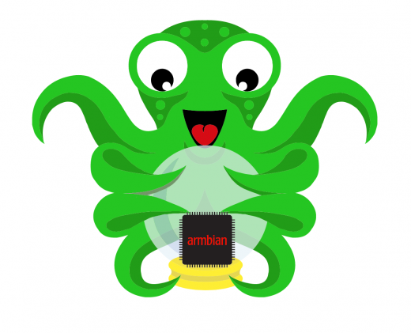

# OctoPrint for other fruits
<p align="center">
  
</p>
A custom distribution based on [Armbian](https://www.armbian.com) for running [OctoPrint](https://octoprint.org) for other Pi-like single board computers.  


Credits of this project are for the awesome Armbian team and the outstanding work of @guysoft creating the custom distribution [OctoPi](http://github.com/guysoft/OctoPi) . This port reuse most of OctoPi's code adapting it to the armbian build process and board specs and provide some helper sripts to  simplify installation and maintance of the distribution.

**If you like this project please consider [contributing](#Contributing).**
<p align="center">
  <a href="https://www.buymeacoffee.com/boros" target="_blank"></a>
</p>

## Features

Core (installed and enabled):
* Optimized armbian Debian buster.
* Latest stable octoprint version.
* Selection of top octoprint plugins.
* HAProxy with self signed keys for ssl access.
* Avahi service: Bonjur addvertisement (this enable to acces with host-name.local via ssh or http/s)
* SSH console access.
* USB OTG console access (if available in the board)
* Enabled i2c-dev, spidev, uart (if available on the board)

3D printer related software:
* Quick install of Klipper. 
* PlatformIo core for building 3D printer firmware.
* Marlin 1.1.x & Marlin 2.x.x firmware (bugfix versions)  

Extras (installed but disabled):
* MPGStreamer USB camera support (experimental)
* SMB shares to remote edit configuration files from a remote PC.


## Usage

Prebuilt images:

1. Download & extract disk image (*.img.7z) from *releases*.
2. Burn the image in a SD card (>8GB recommended) using *usbimager*,*Etcher*, *Win32DiskImager*, *dd* or the image burner of your choice.
3. Plug the SD card on the board and apply power.

First boot tipically require a few minutes. Once booted octoprint will be available to use. If your computer is able to resolve mDns (macos or linux avahi) the name of the board is preconfigured as ```citrico-<board>.local```.

After boot you can access to octroprint server:
- Access to octoprint via https
- ssh session
- Console on Usb OTG (if the board supports it)
- Console on board's serial interface with a USB-TTL 
- Conecting a keyboard and screen (if the board supports it)

Armbian do not activate WiFi by default. Any initial network access requires ethernet connection if available on the board or configuring wifi access using a keyboard and monitor.

## Default users and passwords:

**octoCitrico** create a two users:
- ```root``` with default password ```octoroot``` 
- ```pi``` with default password ```pi```. This user has ```sudo``` rights.

It's recommended but not mandatory to change user passwords and disable root access via SSH.

## Camera configuration
As derivative distribution of OctoPi **Octocitrico** support camera operation out of the box using the same configuration files of OctPi. Any USB camera/webcams supported by debian in your single board computers and by [MJPG-Streamer](https://github.com/jacksonliam/mjpg-streamer) would work. Other cameras might require addtional software installation or configuration steps.

Refer to OctoPi [documentation](https://community.octoprint.org/knowledge-explorer?topic=21149) and online tutorials on how to tune your camera. You can edit camera options using ```scripts/citrico-config``` helper tool.


> **Caveat:**
> By default webcam streaming service is disabled, you need to enable it before is available for octoprint.
> it can be enabled by running ``scripts/citrico-config`` with the ``pi`` user. 


## Customizing
For configuring WiFi or customize your instance you need to log into you octocitrico server and configure as you want as in any linux computer. Armbian and octocitrico provides helper scripts to make easy the configuration of the box. 

Login with the ```pi``` user:

- ```armbian-config```: Fullfleged configuraion tool.
- ```nmtui```: Network configuration.
- ```scripts/citrico-config```: Enable or disable **octocitrico** default services and edit **octopi** camera configuration.
- ```scripts/install-klipper```: Install Klipper 3D printer software.

For accessing files via SMB(windows shares) you need to enable Samba service (preconfigured) using ```scripts/citrico-config```. A default share ```pi-files``` will be avaible using ```pi``` user.

## Adding boards
Adding boards to the project requires few steps:
1. Create a folder with the name of the board inside ```boards``` directory.
2. Inside the __new board__ directory create the a new file ```config.conf``` using as template the existing board.
3. Optionaly create ```extra.sh``` script to adjust specific board configuration.  

**PRs are wellcome with new boards support.**

## Building

Building the distribution requires:

- Linux or MacOs
- Vagrant + Virtualbox
- +50Gb of free disk space.
- +4Gb RAM

```bash
$ git clone <this repository>
$ cd optocitrico
$ ./optocitrico.sh box
$ ./optocitrico.sh assets
$ ./optocitrico.sh build <board_name>
```

Build process is slow and verbose it could take up to 3h depending on your hardware. Be patient.  

## Cleaning
Building process could use a lot of space of your disk. To free this space after building you can execute ```./optocitrico.sh clean```. This will clean all files used for the build including virtual machines and vagrant boxes.

## Tested boards

- Orange Pi Zero 256 Mb (not recommended due to low memory)
- Orange Pi Zero 512 Mb

WIP:

- Orange Pi One
- Orange Pi PC

## Contributing
If you like this project and you want support it please consider:

- Send PRs are to fix bugs and add new boards.
- Test bords and provide feeback.
- Make a donation to Armbian, Octoprint & OctoPi projects.
- Make a donation to this project [here](https://www.paypal.com/cgi-bin/webscr?cmd=_s-xclick&hosted_button_id=TK8N2EFVAZM6W&source=url): This will enable to buy boards for testing and to pay cloud infrastructure to improve the compilation process.
<p align="center">
<a href="https://www.buymeacoffee.com/boros" target="_blank"></a>
</p>